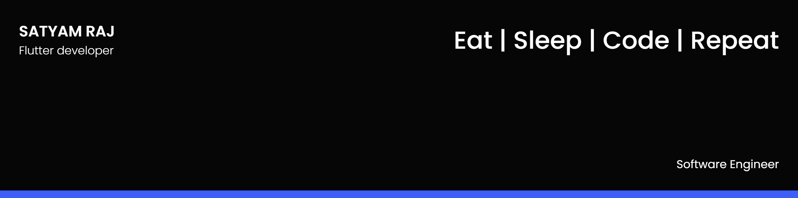

##  About Me

- 🔭 I’m currently pursuing Software Engineering

- 🌱 I'm a Full Stack Flutter Developer.

- 👯 I loves to collaborate an learn new technologies.

- 📫 Contact me **[here](1905053@kiit.ac.in)**

## ✍ My Work

Here are some of my projects on Github:

## 📚 My Skills

## 🤝 Connect

